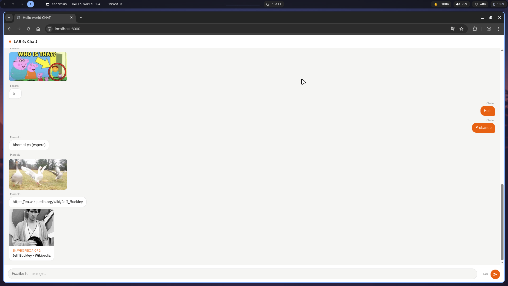

# Hello World CHAT 💬

Servidor HTTP hecho en Go desde cero (sin frameworks) con chat en tiempo real conectado a una API externa.

## Screenshot

### Página Principal


## Cómo correr el proyecto

### Requisitos

- Go 1.21+

### Instalación

```bash
git clone https://github.com/MarceloDetlefsen/lab6-web.git
cd lab6-web
go run main.go
```

Abrí el navegador en `http://localhost:8000`

### Estructura del proyecto

```
.
├── main.go          # Servidor HTTP, proxy a la API y endpoint de previews
├── static/
│   ├── index.html   # Estructura del chat
│   ├── styles.css   # Estilos y diseño
│   └── script.js    # Lógica del cliente, renderizado y previews
└── README.md
```

## Endpoints

| Método | Ruta              | Descripción                                      |
|--------|-------------------|--------------------------------------------------|
| GET    | `/`               | Página principal del chat                        |
| GET    | `/api/messages`   | Proxy — obtiene mensajes de la API externa       |
| POST   | `/api/messages`   | Proxy — envía un mensaje a la API externa        |
| GET    | `/api/preview`    | Extrae metadata (og:title, og:image, etc.) de una URL |

## Funcionalidades implementadas

| Funcionalidad | Puntos |
|---------------|--------|
| Diseño de interfaz (burbujas, tipografía, color) | 50 |
| Campo de texto fijo en la parte inferior | 10 |
| Límite de 140 caracteres por mensaje | 10 |
| Submit del mensaje con Enter | 10 |
| Auto-refresh de mensajes cada segundo | 10 |
| Preservar scroll al recibir nuevos mensajes | 20 |
| Preview de imágenes detectadas en el texto | 30 |
| Preview de links con título, imagen y descripción | 40 |

**Total: 180 puntos**

## Detalles técnicos

- El servidor actúa como **proxy reverso** hacia `https://chat.joelsiervas.online/`, evitando problemas de CORS en el cliente
- El endpoint `/api/preview` hace fetch server-side de cualquier URL, lee hasta 512KB del HTML y extrae las meta tags Open Graph (`og:title`, `og:description`, `og:image`), con fallback a `<title>` y meta `description` estándar
- El cliente detecta automáticamente si un mensaje es una **URL de imagen** (jpg, png, gif, webp, svg) y la renderiza inline; si es otro tipo de link, solicita el preview al servidor
- Las previews se **cachean en memoria** en el cliente para no repetir fetches en cada ciclo de refresh
- El auto-refresh es inteligente: **no re-renderiza** si el número de mensajes no cambió
- El scroll solo se mueve al fondo si el usuario **ya estaba al fondo**; si subió a leer mensajes anteriores, no lo interrumpe
- Los mensajes vacíos devueltos por la API son **filtrados** antes de renderizar

## 👨‍💻 Autor

Marcelo Detlefsen - 24554